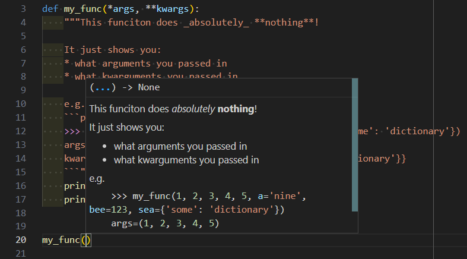

```
 _____                 _   _                 
|  ___|   _ _ __   ___| |_(_) ___  _ __  ___ 
| |_ | | | | '_ \ / __| __| |/ _ \| '_ \/ __|
|  _|| |_| | | | | (__| |_| | (_) | | | \__ \
|_|   \__,_|_| |_|\___|\__|_|\___/|_| |_|___/
```

Dead easy this one.

# Declare them
``` python
def my_cool_function():
    # some code
```

Want to pass in arguments?
``` python
def my_really_cool_function(a, b, c):
    # some code that does something with the variables a, b, and c
```
Want a default value?
``` python
def my_func(a='default value'):  # note the lack of space around the '='
    # some stuff
```

Want to return something?
Use the keyword `return`
``` python
def my_useful_function():
    return "You wanted this, right?"
```

# Call them
Without arguments:
``` python
my_cool_function()
```

With arguments:
``` python
my_really_cool_function(1, 'hi', True)
# Alternatively:
my_really_cool_function(b='hi', a=1, c=True)  # Note the lack of spaces around the '=', and that the parameters don't have to be in order
```
The first method of passing parameters makes use of "args" (or arguments), the second method makes use of "kwargs" (or kwarguments, just kidding they're called keyword-arguments). You can use a combination of arguments and kwarguments but you have to pass in your kwarguments _after_ your arguments.  


Assigning the output:
``` python
the_returned_value = my_useful_function()
```

# Returning and accepting multiple variables

If you need to return multiple objects, we can use a tuple and then tuple unpacking.

So, say you have a function that sorts the elements of some list into those that are long and those that are short.  
The first bit we need to tackle is packing the two variables into a tuple. Let's say we did our algorithm like this:
```python
def sorting_func(some_list: list[str]):
    """sorts elements into a list of elements with length less than
    a boundary and elements longer than or equal to a boundary.

    **returns**: `(list of short elements, list of long elements)`"""
    boundary = 5
    short_list = []
    long_list = []
    for element in some_list:
        if len(element) < boundary:
            short_list.append(element)
        else:
            long_list.append(element)

    # Note the way we pack the returned variables into a tuple
    return (short_list, long_list)
```

The way to retrieve these returned variables is as so:
```python
short, long = sorting_func(['a', 'asd', 'qwerty', 'zxcvbnm'])
```


## Arguments and Kwarguments
For example, say we have this function:
```python
def my_func(a, b, c=3, d=4, e=5):
    print(F"{a}, {b}, {c}, {d}, {e}")
```
Here `a` and `b` do not have default values, so they always need to be passed in as either args or kwargs.  
e.g.
```python
>>> my_func(99, 98)  # as arguments
99, 98, 3, 4, 5
>>> my_func(a=99, b=98)  # as kwarguments
99, 98, 3, 4, 5
```
Now, say you want to keep the default value of `c` and `e` but want to change `d`. We do that like so:
```python
>>> my_func(a=99, b=98, d=66)
99, 98, 3, 66, 5
>>> my_func(99, 98, d=66)
99, 98, 3, 66, 5
```
but you can't do:
```
>>> my_func(d=66, 99, 98)
  File "<stdin>", line 1
    my_func(d=66, 99, 98)
                        ^
SyntaxError: positional argument follows keyword argument
```

# Arbitrary Arguments and Kwarguments
So, when I delivered this lesson in person I was asking how you make go about overloading a function like you can in Java and this is the method I prescribed though there is [an alternative](https://peps.python.org/pep-3124/) which you might prefer.  

Ok, so now lets say that you want a function that can accept some arbitrary parameters. You can do so like this:
```python
def my_func(*args, **kwargs):
    print(F"{args=}")
    print(F"{kwargs=}")
```
When called with any number of arguments and kwarguments, you get this:
```
>>> my_func(1, 2, 3, 4, 5, a='nine', bee=123, sea={'some': 'dictionary'})
args=(1, 2, 3, 4, 5)
kwargs={'a': 'nine', 'bee': 123, 'sea': {'some': 'dictionary'}}
```
As you can see:
* `args` becomes a `list` of all positional arguments
* `kwargs` becomes a `dict`ionary mapping of the kwarguments

This can be used in conjunction with match-case statements and docstrings to provide a fairly robust interface. Sorry we've not covered raising errors yet but we'll get to that in Lesson_02.

# Wait, what are docstrings?
Docstrings are handy little strings you can just float inside the top of your function to give other developers a bit more info in their IDE if needed when they either open the parentheses of your function or hover over it later.  
Docstrings broadly follow markdown formatting when getting rendered but they also follow PEP8 so you can't have trailing spaces.

Say we add the following docstring to our above function:
```python
def my_func(*args, **kwargs):
    """This funciton does _absolutely_ **nothing**!

    It just shows you:
    * what arguments you passed in
    * what kwarguments you passed in

    e.g.
    ```python
    >>> my_func(1, 2, 3, 4, 5, a='nine', bee=123, sea={'some': 'dictionary'})
    args=(1, 2, 3, 4, 5)
    kwargs={'a': 'nine', 'bee': 123, 'sea': {'some': 'dictionary'}}
    ```"""
    print(F"{args=}")
    print(F"{kwargs=}")
```

In VSCode, that renders as:  




### Right, consider yourselves bootstrapped! Let's get [a little challenge](./09_challenge.md) under our belts