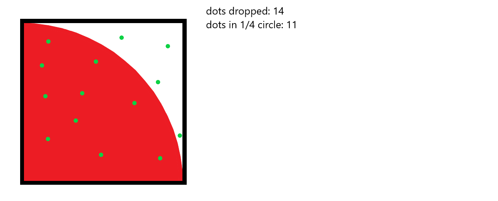

```
    _      _     _ _   _   _      
   / \    | |   (_) |_| |_| | ___ 
  / _ \   | |   | | __| __| |/ _ \
 / ___ \  | |___| | |_| |_| |  __/
/_/   \_\ |_____|_|\__|\__|_|\___|
                                  
  ____ _           _ _                       
 / ___| |__   __ _| | | ___ _ __   __ _  ___ 
| |   | '_ \ / _` | | |/ _ \ '_ \ / _` |/ _ \
| |___| | | | (_| | | |  __/ | | | (_| |  __/
 \____|_| |_|\__,_|_|_|\___|_| |_|\__, |\___|
                                  |___/     
```

# Righty! We're going to approximate pi!  
It's way easier and quite a bit more fun than you'd expect. It was one of the mini challenges for pi day that I put in the North West capability channel (#northwest-dev-capability).  

# How are we doing that then?
There is a bit of maths to it... sorry about that.  

Basically, we imagine a square with a quarter circle on it where the edge of the square is the same length as the radius of the circle.  


We then start randomly dropping points in the square and track both how many points we've dropped and how many points hit the quarter circle.  
  

We can easily calculate the area of the square as it's just length squared. This can also be made easier by choosing a length of 1 unit.  
The ratio of dots dropped Vs dots in the quarter circle can then be used to infer the area of the quarter circle (given a truly random distribution the area of the quarter circle is `area_of_square * dots_in_quarter_circle / dots_dropped`)  
  

Now, the area of a circle is pi times the radius squared. We know a quarter of the area, and we know the radius. So, from here we can now calculate an estimation of pi.  
  

# Alright cool, we know some maths but how does that translate to Python code?
Ok, well I reckon you could puzzle it out if you fancied it but we can go over this together if you prefer.  

Here's the steps:

1. We need to import `random` so we can use `rand_int()`
1. We need to initialise two ints at zero, one for dots dropped and one for dots which hit the quarter circle
1. Now we can enter an infinite loop in order to drop an infinite number of points
1. Here we can choose an x and y coordinate for our dropped point
    * let's say the resolution of the square is 1,000,000 (hold it in a variable if you like, it comes up later)
1. Since we've dropped a dot, we can increment the dots dropped variable
1. Now, we need to figure out if the dot hit the quarter circle or not:
    * so the dot hit the circle if it's distance from (0,0) is less than or equal to the radius since the quarter circle is centered on (0,0)
    * for that we can use Pythagoras (a squared plus b squared equals c squared, or in Python: `a**2 + b**2 = c**2`)
    * so if "random points x coord" squared plus "random points y coord" squared is less than or equal to our resolution squared, then it hit the quarter circle
1. If the dot hit the quarter circle, then increment that variable too
1. Now we can come up with a pi-estimation (or pistemation if you're feeling hilarious)
    * it was 4 times dots in quarter circle divided by dots dropped
1. Lastly, we just print out the pistemation in the bottom of the loop

# Can't be arsed to do all that?
Totally get that, at this point you likely have something to get back to
### [Check out my code if you like](./10_solution.py)
