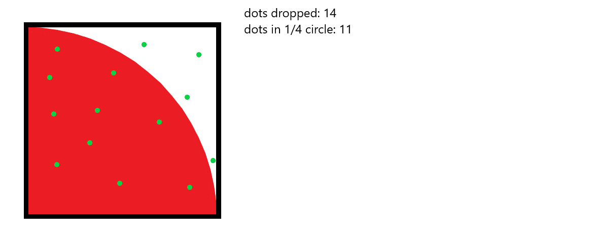

```
    _      _     _ _   _   _      
   / \    | |   (_) |_| |_| | ___ 
  / _ \   | |   | | __| __| |/ _ \
 / ___ \  | |___| | |_| |_| |  __/
/_/   \_\ |_____|_|\__|\__|_|\___|
                                  
  ____ _           _ _                       
 / ___| |__   __ _| | | ___ _ __   __ _  ___ 
| |   | '_ \ / _` | | |/ _ \ '_ \ / _` |/ _ \
| |___| | | | (_| | | |  __/ | | | (_| |  __/
 \____|_| |_|\__,_|_|_|\___|_| |_|\__, |\___|
                                  |___/     
```

# Righty! We're going to approximate pi!  
It's way easier and quite a bit more fun than you'd expect. It was one of the mini challenges for pi day that I organised at work once upon a time.  

# How are we doing that then?
There is a bit of maths to it... sorry about that.  

Basically, we imagine a square with a quarter circle on it where the edge of the square is the same length as the radius of the circle.  


We then start randomly dropping points in the square and track both 
1. how many points we've dropped 
1. and how many points land on the quarter circle.  
  

We can easily calculate the area of the square as it's just length squared. This can also be made easier by choosing a length of 1 unit - giving an area of `1x1 = 1`.  
The ratio of dots dropped Vs dots in the quarter circle can then be used to infer the area of the quarter circle. If the quarter circle was one third of the size of the square then we would expect 1/3 (1 in every 3) of all the dots dropped to land on the quarter circle.  
It's not a third but it is `dots_in_quarter_circle / dots_dropped` multiplied by the area of the square (which was 1).  
  

Now to calculate the area of a whole circle, you do pi times the radius squared.  
Our circle has a radius of 1, and 1 squared is 1, and 1 times pi is just pi.  
We've already calculated the area of our quarter of a circle. Since four quarters make a whole, we just need to multiple the area of our quarter of a circle by 4 to find out the area of a whole circle with a radius of 1. We also know that the area of a whole circle with a radius of 1 is pi.  
Therefore, if we just take the little bit of quarter circle area we calculated earlier and times it by 4, it should equal pi (or there abouts).  
  

# Alright cool, we know some maths but how does that translate to Python code?
Ok, well I reckon you could puzzle it out if you fancied it but we can go over this together if you prefer.  

Here's the steps:

1. We need a way of choosing random points, so from the `random` library import the `randint` function. [hint](./01_set_up.md#importing-libraries-well)
1. We'll need to be able to track the number of points we drop and the number of points hitting the quarter circle. So initialise two ints at 0. [hint](./02_variables.md#numbers)
1. Now we need to repeatedly drop points. Since an infinite number of points is needed to calculate pi accurately, we'll enter an infintie loop. [hint](./07_loops.md#while-loop)
1. We can finally drop our first point, so use the `randint` function to pick a random x and y coordinate. I know we said the square had a length of 1 but lets cut it up into a 1,000,000 by 1,000,000 grid and pick points on that.
1. So now we've dropped a point, we can add that to the count. [hint](./05_operations.md#terse-maths)
1. But we still need to figure out whether that hit our quarter circle or not. If it did, then it would be less than the radius of the circle away from it's centre. The centre is on the corner and we can just say that's the corner with a coordinate of (0, 0).
    * Now we can use pythagoras to figure out how far from the centre it is. Pythagoras is a squared plus b squared equals c squared, in Python that's: `a**2 + b**2 = c**2`, in words that's _short side_ squared plus _other short side_ squared equals _long side_ squared.
    * So if a and b are the short sides, they're just the x and y values. And then c is just going to be the long side - which is the distance from the centre of the circle.
    * We know we want that value to be less than or equal to the radius of the quarter circle for it to count as a hit
    * Our radius (as measured on our new 1,000,000 by 1,000,000 grid) is 1,000,000.
    * so `x**2 + y**2` wants to be less then or equal to `1_000_000**2` to count as a hit.
    * [hint](./05_operations.md)
1. If we hit the circle, make sure to increase the counter [hint](./06_logic_gates.md#if-elif-else)
1. Now we can come up with a pi-estimation (or pistemation if you're feeling hilarious)
    * it was 4 times dots in quarter circle divided by dots dropped
1. Lastly, we just print out the pistemation in the bottom of the loop. [hint](./04_input_output.md#output)

# Can't be arsed to do all that?
Totally get that, at this point you likely have something to get back to
### [Check out my code if you like](./10_solution.py)