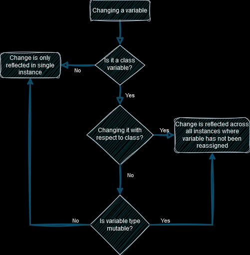

```
 ___       _               _ _                       
|_ _|_ __ | |__   ___ _ __(_) |_ __ _ _ __   ___ ___ 
 | || '_ \| '_ \ / _ \ '__| | __/ _` | '_ \ / __/ _ \
 | || | | | | | |  __/ |  | | || (_| | | | | (_|  __/
|___|_| |_|_| |_|\___|_|  |_|\__\__,_|_| |_|\___\___|
```
# Inheritance
Let's say we've got the following class:
```python
class Rectangle:
    NUMBER_OF_EDGES = 4
    NUMBER_OF_CORNERS = 4

    def __init__(self, length: int, width: int):
        self.length = length
        self.width = width

    def area(self) -> int:
        return self.length * self.width

    def perimeter(self) -> int:
        return (
            self.length * 2
            + self.width * 2
        )
```
It defines:
* four attributes (`NUMBER_OF_EDGES`, `NUMBER_OF_CORNERS`, `length` and `width`)
* three methods (`__init__`, `area` and `perimeter`)

To note:
* `NUMBER_OF_EDGES` and `NUMBER_OF_CORNERS` are defined outside of the `__init__` method (this has an interesting behaviour that we will dig into a little further down)

Now let's say say we're using `Rectangle` a lot to define squares, so now we want a specialist class just for squares.  

We'll still want methods for the area and the perimeter, and squares will still have the fundamental truth that they have 4 edges and 4 corners.  
We can inherit from the `Rectangle` class like so:
```python
class Square(Rectangle):

    def __init__(self, length: int):
        self.length = length
```
_This is a broken implementation, have you spotted it yet?_  

It defines:
* it's parent (between parentheses after the name declaration but before the colon)
* a new `__init__` function

It does inherit:
* two variables (`NUMBER_OF_EDGES` and `NUMBER_OF_CORNERS` since these were not defined within the overwritten `__init__` method)
* two methods (`area` and `perimeter`)

It **_does not_** inherit:
* anything declared in the parent's `__init__` method, as we overwrote that method (meaning there's no width, which means `area()` and `perimeter()` are broken)

## Let's do that better
So, of course you could simply declare the `width` attribute yourself but that feels silly and prone to error. Not to mention we'd be constantly trying to keep up with any changes in the parent class.  
Instead, we can just use the parent's `__init__` method by using the builtin function `super()`. Doing this is similar to invoking methods on your own class, except that instead of using the `self` keyword, we use the `super()` function. Like this:  
```python
class Square(Rectangle):

    def __init__(self, length: int):
        super().__init__(
            length=length,
            width=length
        )
```

Now, the way that this behaves is **not** that it creates an instance of the parent class but _instead_, it borrows that parent's method and uses it as it's own. This means that our `Square` object will now have both a length and a width, and our `area()` and `perimeter()` methods work.  
Using `super()`, you can call on any of your direct ancestors methods, not just the `__init__` method.

## Class variables and instance variables
Now, let's get a closer look here at the different variables we were defining in `Rectangle`...  

The attributes `length` and `width` - which we defined within a method - are what's called **instance variables**, they are:
* not inherited... though the method which declares an instance variable can be inherited and if so will set up the same instance variable for the child class giving the illusion of being inherited
* unique to each instance (i.e. changing the value in one instance will not change the value in another)

The attributes `NUMBER_OF_EDGES` and `NUMBER_OF_CORNERS` - which were defined outside of any method - are what's called **class variables**, they are:
* inherited
* not unique to each instance... _mostly_

Let's tuck into that "mostly"...  

So, a fresh instance of a class will inherit class variables and their values from it's parent. If you change a class variable in an instance of the class, it will now be decoupled from it's parent's definition (unless the class variable type is mutable, in which case the value changes for all coupled instances). If you change the value of a class variable by referencing the class itself and not an instance, then you will change the value for any instance (past, present, and future) which are still coupled to it's parent's definition.

**N.B.** For what you'll see on a daily basis, there are only the three mutable types `dict`, `list`, and `set`.

For an example of how this all works in practice, check out [the class variable demo](./section_02_supplements/class_variable_demo.py). See if you can predict how things will change...

Here's a flow diagram I made to try and clear up that mud...  


### Next up, [even more inheritance!](./03_complex_inheritance.md)


