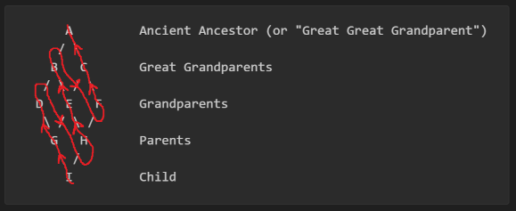

```
  ____                      _           
 / ___|___  _ __ ___  _ __ | | _____  __
| |   / _ \| '_ ` _ \| '_ \| |/ _ \ \/ /
| |__| (_) | | | | | | |_) | |  __/>  < 
 \____\___/|_| |_| |_| .__/|_|\___/_/\_\
                     |_|                
 ___       _               _ _                       
|_ _|_ __ | |__   ___ _ __(_) |_ __ _ _ __   ___ ___ 
 | || '_ \| '_ \ / _ \ '__| | __/ _` | '_ \ / __/ _ \
 | || | | | | | |  __/ |  | | || (_| | | | | (_|  __/
|___|_| |_|_| |_|\___|_|  |_|\__\__,_|_| |_|\___\___|
```
# The complex stuff

So, if you're a Java or a C# dev, you're probably used to only being able to inherit from one class, and then multiple interfaces.  
Well that ain't the situation here! In Python, **there are no interfaces**. But you can inherit from as many classes as you please!

Now, I say there _are no interfaces_ and that is true but there are alternatives. We'll look at [abstract base classes (ABCs)](https://docs.python.org/3/library/abc.html) and [protocols](https://typing.readthedocs.io/en/latest/spec/protocol.html) another time (it's no small topic for sure).

# Multiple Inheritance

All you do to inherit from multiple classes is name more between the parentheses and separate them with commas. Like this:  
```python
class A:
    some_val = 1


class B:
    some_other_val = 2


class C(A, B):
    a_whole_other_val = 3
```

Nice and easy, right?

# No! It's not easy! Nothing is ever this simple once the class is even remotely complex!

Now, multiple inheritance like this can cause issues. What if both parents declare variables in their `__init__` functions and you need both sets? If your parent classes implement the same functions with the same names in slightly different ways, how will you know what implementation you're using?  
Well let me give you some answers!  

So, say we've got an `Eagle` class and a `Horse` class, like so:

```python
class Horse:

    def __init__(self):
        self.legs = 4

    def make_noise(self):
        print("NeeEEeeeIIiigh!!")

    def gallop(self):
        print("Galloping!")


class Eagle:

    def __init__(self):
        self.wings = 2

    def make_noise(self):
        print("ScreeeEEEeee!!")

    def fly(self):
        print("Flying!")
```

Now say we want to inherit from both to make a `Hippogriff`. We've got a couple of problems...
* what noise will a `Hippogriff` make?
* how do we invoke both parents `__init__` methods to ensure we get 4 legs and 2 wings?

# What noise does a `Hippogriff` make?

So, in Python you have the concept of a "Method Resolution Order" (or "MRO"). This refers to the order in which parent classes are searched in order to find a method. You can view the MRO with the following code:
```python
class Hippogriff(Horse, Eagle):
    # No idea what to put in here yet
    pass

print(Hippogriff.mro())
```

Which gives the following output:
```
[<class '__main__.Hippogriff'>, <class '__main__.Horse'>, <class '__main__.Eagle'>, <class 'object'>]
```

So from this, we can see that our `Hippogriff` class is searched first, then the `Horse` class, the `Eagle` class, and finally the `object` class. The `object` class is just the class that all Python objects are derived from, it's not something you ever have to explicitly set, nor is it something to meditate on so we can just forget about it. But this MRO does give us our answer, since `make_noise` is defined in both the `Horse` and `Eagle` class, and since the MRO reaches `Horse` before `Eagle` we know that `Hippogriff`s "neigh".  

Who would've predicted that hippogriffs neigh?


## Predicting the MRO

The MRO is actually super predictable. Essentially it maps out the MRO going depth first, left to right, making sure that parents are always after children. So, imagine you've got the following inheritance nonsense:

```
      A         Ancient Ancestor (or "Great Great Grandparent")
     / \
    B   C       Great Grandparents
   / \ / \
  D   E   F     Grandparents
   \ / \ /
    G   H       Parents
     \ / 
      I         Child
```

Classic [diamond problem](https://en.wikipedia.org/wiki/Multiple_inheritance#The_diamond_problem) albeit a little off the rails.

And let's implement that in Python:
```python
class A: ...
class B(A): ...
class C(A): ...
class D(B): ...
class E(B, C): ...
class F(C): ...
class G(D, E): ...
class H(E, F): ...
class I(G, H): ...
```
Funnily enough this is actually valid Python, it just doesn't follow PEP8 standards. But I really just wanted to draw attention to the order in which we're declaring the parent classes. So, if the parent is on the left in the diagram, it's also on the left in the parent declarations.  

So, how are we predicting the MRO for the `I` class then? We'll just use the same logic that Python does:  

Imagine we start at our class in question (`I`) with a list that only has `I` in it.  
Next thing to do is to look at the parent declaration and inspect the first parent. This is `G`, so we add `G` on the end of the list and move onto `G`.  
Now we're at `G` so we look at it's parents (`D` and `E`), `D` is first so we add that to the end of the list and move onto `D`.  
`D` has parent `B` so add `B` and move onto `B`.  
`B` has parent `A` so add `A` and move onto `A`.  
Now we don't have anywhere else to go, so we backtrack.  
We go back to `B`, we've explored all of `B`s parents, so we back track further to `D`.  
Same situation, so we back track to `G`. Now at `G` we have the unexplored parent `E`, so we add `E` to the end of the list and move onto it.  
Now `E` has two parents and the first declared is `B`, but `B` is already in the list, we just move it to the end of the list and move onto it.  
`B` has parent `A` and `A` is in the list so we move it to the end of the list and move onto `A`.  
Now we don't have anywhere else to go, so we backtrack.  
We go back to `B`, we've explored all of `B`s parents, so we back track further to `E`.  

This just goes on and on and on until we finish. It's not a particularly efficient algorithm but it provides clear and predictable MROs.
Just to show the full search (with a slightly less wordy explanation), I've popped that on [a separate page](./section_03_supplements/mro_construction_pattern.md) for you to look at and I've visually drawn it out here:  



So ultimately, we are predicting an MRO of:
```
[I, G, D, H, E, B, F, C, A]
```
When we try it in Python we get:
```python
[<class '__main__.I'>, <class '__main__.G'>, <class '__main__.D'>, <class '__main__.H'>, <class '__main__.E'>, <class '__main__.B'>, <class '__main__.F'>, <class '__main__.C'>, <class '__main__.A'>, <class 'object'>]
```
Which is correct, because I would never steer you wrong <3  
If you want to try it yourself, I've left the [code here](./section_03_supplements/mro_complex_diamond_problem_code.py). Try making `E` only inherit from `C` and see if you can predict the result!


# How do we give the `Hippogriff` enough legs and wings?

The issue with just using `super()` is that it follows the MRO after ignoring your own class. Meaning that `super().__init__()` would only invoke the `Horse`'s `__init__` method but we need the wings of an `Eagle` and that can only be added via the `Eagle`'s `__init__` method.

So in this case we need to invoke both parent's `__init__` methods and that is done like so:

```python
class Hippogriff(Horse, Eagle):
    def __init__(self):
        Horse.__init__(self)
        Eagle.__init__(self)
```
Here, we are explicitly calling the member functions of `Horse` and `Eagle` as sort of static methods, but since we pass our class in as the `self` parameter, it acts on our class.

# Well what if you need some bits from one `__init__` and some from another but both will overwrite the other?

Let's modify the `Eagle` and `Horse` classes to best illustrate the issue:

```python
class Horse:

    def __init__(self):
        self.legs = 4
        self.head = 'horse head'
        self.body = 'horse body'

    def make_noise(self):
        print("NeeEEeeeIIiigh!!")

    def gallop(self):
        print("Galloping!")


class Eagle:

    def __init__(self):
        self.wings = 2
        self.head = 'eagle head'
        self.body = 'eagle body'

    def make_noise(self):
        print("ScreeeEEEeee!!")

    def fly(self):
        print("Flying!")


class Hippogriff(Horse, Eagle):
    def __init__(self):
        Horse.__init__(self)
        Eagle.__init__(self)
```

Now when we instantiate the `Hippogriff` class, the bugger is going to end up with a body of `"eagle body"` and a head of `"eagle head"`! So what's best to do here?  
Truth of the matter is, there's plenty of ways to skin a hippogriff. My recommendation is to use a bit of name mangling.

We do name mangling in Python by giving an attribute a double leading underscore. So let's refactor the `Horse` class so the assignment of a body happens in a separate name mangled function. To use it later though, we'll need to call that function from inside a non-name mangled version.  

So, we get this:
```python
class Horse:

    def __init__(self):
        self.legs = 4
        self.head = 'horse head'
        self.__assign_body()

    def __assign_body(self):
        self.body = 'horse body'

    def assign_body(self):
        self.__assign_body()

    def make_noise(self):
        print("NeeEEeeeIIiigh!!")

    def gallop(self):
        print("Galloping!")
```

What happens to name mangled attributes under the hood is that they are reassigned to a different name (`_classname__attributename`). So, `__assign_body()` in the `Horse` class gets renamed to `_Horse__assign_body()` and that name mangled function does get inherited. But you can't directly use that name (well you can but you shouldn't) which is why we made sure to create a none name mangled version too.

So, to fix our `Hippogriff`, we just need to call the `assign_body()` method against the `Horse` class in the same manner we were calling the individual `__init__` methods. 

```python
class Hippogriff(Horse, Eagle):
    def __init__(self):
        Horse.__init__(self)
        Eagle.__init__(self)
        Horse.assign_body(self)
```

## But why did we even do the name mangling?

So, here's the issue.  

Say we didn't do any name mangling and we declared our `Horse` like this:
```python
class Horse:

    def __init__(self):
        self.legs = 4
        self.head = 'horse head'
        self.assign_body()

    def assign_body(self):
        self.body = 'horse body'

    def make_noise(self):
        print("NeeEEeeeIIiigh!!")

    def gallop(self):
        print("Galloping!")
```

And now we create a `ShetlandPony` and let's say this Shetland Pony is a web developer and the Shetland Pony creates it's own `assign_body()` method that returns HTML, like so:
```python
class ShetlandPony(Horse):

    def __init__(self):
        super().__init__()
        self.size = 'smol'

    def assign_body(self):
        return """<body>
          <p>
            Did you know, horses are not made of HTML?
          </p>
        </body>"""
```

Here the `ShetlandPony` uses a `super().__init__()` to invoke the `Horse`'s `__init__` method. This parental `__init__` refers to a `assign_body()` method, but since the `ShetlandPony` has overwritten this method, that's what gets used. All this means that our `ShetlandPony` doesn't get a body, it's just a floating head!

This kind of issue is overcome when you use name mangling and that's why we did it.

### p.s.
I've left you the code to play around with:
* good code in [good_horsey.py](./section_03_supplements/good_horsey.py)
* bad code in [bad_horsey.py](./section_03_supplements/bad_horsey.py)

### Let's move on to [getters and setters](./04_getters_and_setters.md)
