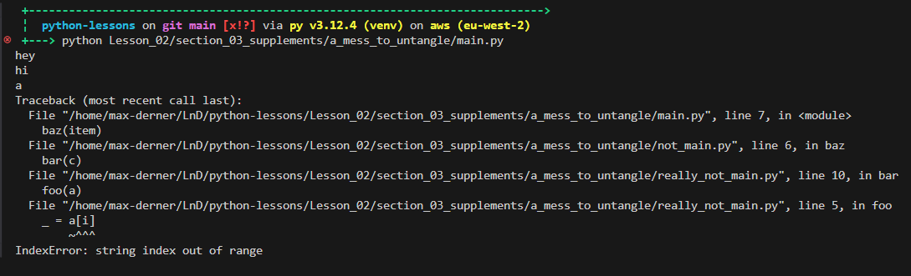
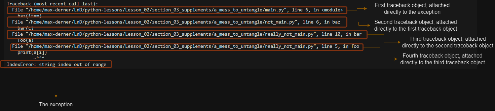
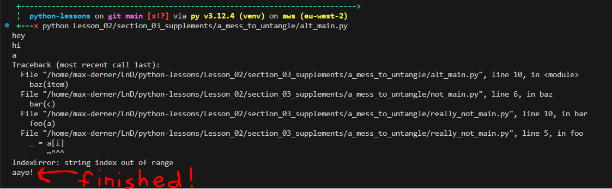

```
 _____                    _   _             
| ____|_  _____ ___ _ __ | |_(_) ___  _ __  
|  _| \ \/ / __/ _ \ '_ \| __| |/ _ \| '_ \ 
| |___ >  < (_|  __/ |_) | |_| | (_) | | | |
|_____/_/\_\___\___| .__/ \__|_|\___/|_| |_|
                   |_|                      
 _____                          _   _   _             
|  ___|__  _ __ _ __ ___   __ _| |_| |_(_)_ __   __ _ 
| |_ / _ \| '__| '_ ` _ \ / _` | __| __| | '_ \ / _` |
|  _| (_) | |  | | | | | | (_| | |_| |_| | | | | (_| |
|_|  \___/|_|  |_| |_| |_|\__,_|\__|\__|_|_| |_|\__, |
                                                |___/ 
```

# What's The Problem?

So, all that business about the `try`/`except` blocks was great and everything but we weren't really exposing much information about each exception. Something that becomes ever more important if you don't know exactly what kind of exceptions are going to be thrown or by what!

# Accessing The Exception

So, if we want to interact with the exception we've just caught we can do so like this:
```python
try:
    print(
        dodgy_function(item)
    )
except Exception as e:
    print(F"EXCEPTION using item {repr(item)}: {repr(e)}")
```
Here, we've aliased the exception as the variable `e`, which then allows us to access the exception object. Here, we've simply printed it out but we can do so much more as we'll see shortly.

[code in `interacting_with_exceptions.py`](./section_03_supplements/interacting_with_exceptions.py)  
`dodgy_function` can be found [in `dodgy_module.py`](./section_03_supplements/dodgy_module.py)  

This also works when chaining `except` blocks, and when handling multiple specific exceptions in a single `except` block:
```python
try:
    print(
        dodgy_function(item)
    )
except (TypeError, KeyError) as e:
    print(F"EXCEPTION using item {repr(item)}: {repr(e)}")
except Exception as e:
    print(F"UNEXPECTED EXCEPTION: {repr(e)}")
```
[code in `diverse_interaction.py`](./section_03_supplements/diverse_interaction.py)

## A Note on Printing Out Exceptions
You can see here that we have used the `repr()` built in function rather than just passing the exception through and letting `print()` cast it as a `str`. This is to surface the exception type as well as the exception message. Please, do not get into the habit of simply printing out exceptions as they are, at the very least pass them into `repr()` as it will save you some headaches.

Consider the following:

```python
def get_value_bad(dictionary: dict, key: Any) -> Any:
    try:
        return dictionary[key]
    except Exception as e:
        print(F"Whooops! Exception caught: {e}")
        return None
```
Looks fine, right? The problem here is that we're only printing the value of the exception and not the type:
```
Python 3.12.4 (main, Jun  6 2024, 18:26:44) [GCC 11.4.0] on linux
Type "help", "copyright", "credits" or "license" for more information.
>>> from Lesson_02.section_03_supplements.error_printing import get_value_bad
>>> my_dict = {'a': 'ayyy!', 'b': 'buzzzz', 'c': 'me now!'}
>>> value = get_value_bad(my_dict, 'd')
Whooops! Exception caught: 'd'
>>> 
```
Now the error message `Whooops! Exception caught: 'd'` is less than useful when you're under stress trying to get a bit of code debugged. Let's change that line to use `repr()` instead:

```python
def get_value_good(dictionary: dict, key: Any) -> Any:
    try:
        return dictionary[key]
    except Exception as e:
        print(F"Whooops! Exception caught: {repr(e)}")
        return None
```
Now when we do the same thing we get this:
```
Python 3.12.4 (main, Jun  6 2024, 18:26:44) [GCC 11.4.0] on linux
Type "help", "copyright", "credits" or "license" for more information.
>>> from Lesson_02.section_03_supplements.error_printing import get_value_good
>>> my_dict = {'a': 'ayyy!', 'b': 'buzzzz', 'c': 'me now!'}
>>> value = get_value_good(my_dict, 'd')
Whooops! Exception caught: KeyError('d')
>>> 
```
Here the line `Whooops! Exception caught: KeyError('d')` is very obvious with what we're dealing with. `KeyError` means dictionaries and that narrows scope by a tonne!

# Formatting the Exception
I'll not dive too deep on this one but you can print the entire traceback for an exception. So, exceptions in Python have attached to them a traceback which may or may not have it's own traceback attached to it.  
So, you have your initial exception. This contains a nice bit of info; it declares itself as a particular type of exception, it contains an error message, it can have a context (whereby it says "I happened when trying to sort _that_ exception out"), **and** it may or may not have a little tail of traceback objects.  
The traceback objects allow you to _trace back_ the exception to where it originates. Each traceback object contains information on where it's been as it's bubbled up. Let's just get a look at a full stack trace and I can point out what's what for you.



This stacktrace has been generated by running the code found at [section_03_supplements/a_mess_to_untangle/main.py](./section_03_supplements/a_mess_to_untangle/main.py). The `main` module uses a function from the `not_main` module, which in tern uses a function from the `really_not_main` module which then uses yet another function from the same module, which is finally where that exception is occurring. There is nothing in place to catch that exception so it just bubbles all the way back up to the `main` module where it finally halts the program and gives this lovely stacktrace. Now if I annotate that stack trace, you should start to understand how an `exception` can have a tail of `traceback` objects.



## The `traceback` Module

Looking at just the exception itself is great for a hint, but if you need something a little more then you can dig through the tracebacks to pinpoint it exactly. There's a whole standard Python library built with this express purpose in mind called [traceback](https://docs.python.org/3/library/traceback.html).

Now instead of doing stuff like `print(repr(e))`, we can do something a little cooler like this:  
```python
from traceback import print_exception


if __name__ == "__main__":
    for item in ['hey', 'hi', 'a', 'aayo!']:
        print(item)
        try:
            baz(item)
        except Exception as e:
            print_exception(e)
```
Where `print_exception` gives exactly the same stacktrace we saw earlier, and because we caught the exception we can carry on with the rest of the program:  
  
The code which produced that printout can be found in [./section_03_supplements/a_mess_to_untangle/alt_main.py](./section_03_supplements/a_mess_to_untangle/alt_main.py)

# [Let's look at how to create a custom exception class now](./04_custom_exceptions.md)